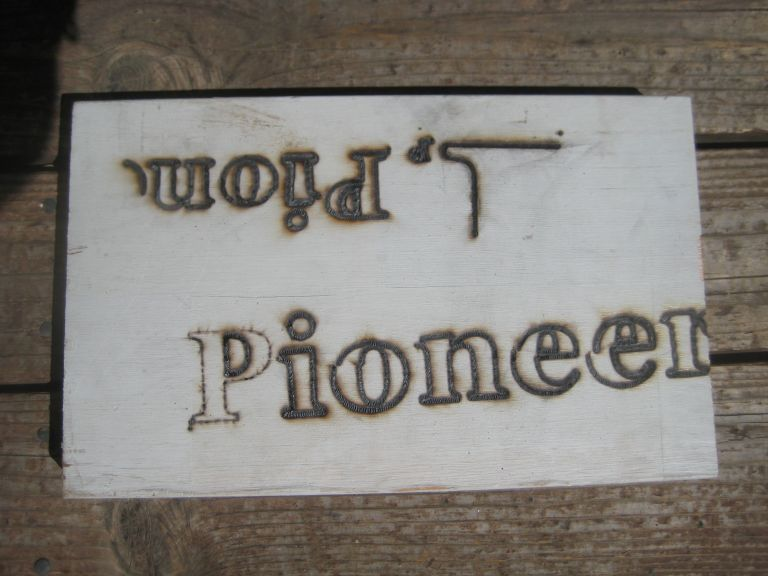

# Solar plotter

Code to support a solar plotter, which is a device that burns 2-D patterns into
wood by focusing the sun’s light using a moving magnifying glass.

The `adjust_for_sun.py` script adjusts a G-code file to take into account
the movement of the earth while the plot is on-going. It pre-moves the
plot so that the position will be correct after the earth rotates.

    % python adjust_for_sun.py < in.g > out.g

If you don't do that, circles don't even close, like the `e` in the lower-right
of this plot:

The `GCodes.java` program converts a raster image to a G-code file to burn
that image using a solar plotter.

    % javac GCodes.java
    % java GCodes bertrand-russell-high-res.jpg

It works better on low-res images:

See the [full write-up](https://www.teamten.com/lawrence/writings/solar_plotter.html)
for more info about both of these.

# License

Copyright 2010 Lawrence Kesteloot

Licensed under the Apache License, Version 2.0 (the "License");
you may not use this file except in compliance with the License.
You may obtain a copy of the License at

   http://www.apache.org/licenses/LICENSE-2.0

Unless required by applicable law or agreed to in writing, software
distributed under the License is distributed on an "AS IS" BASIS,
WITHOUT WARRANTIES OR CONDITIONS OF ANY KIND, either express or implied.
See the License for the specific language governing permissions and
limitations under the License.
